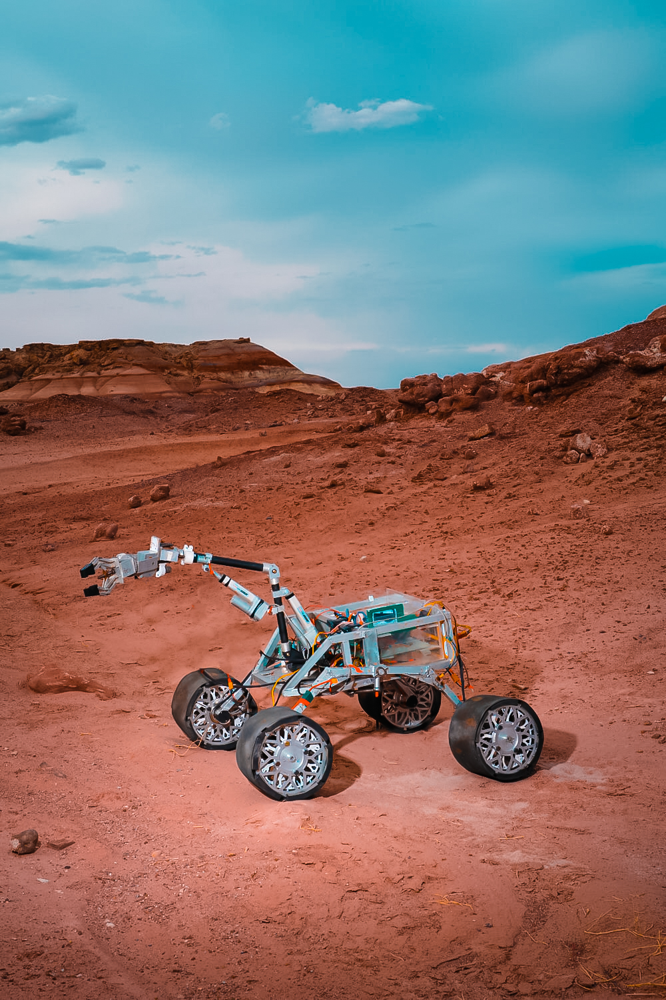

# MarsRover-Prototype-Inferno-URC
This the Simulation of our mars rover prototype for European Rover Chalenge
This rover has the capabilities to traverse rough terrain autonomously and perform various task using its 6-DOF robotic arm like astronaut assistance, path clearing, flipping switches, typing etc.

## Prerequisites
1. Linux Machine (Pref. Ubuntu 18.04)
2. ROS Melodic 
3. Gazebo 9
4. Rviz
5. RP-LIDAR SDK
6. Arduino IDE

## Sceenshots and Photos

